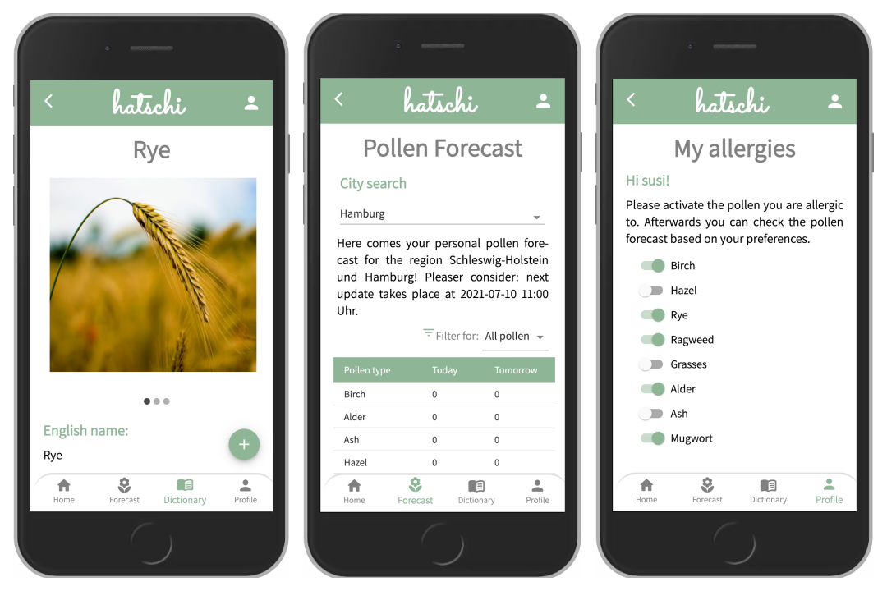

# hatschi - the pollen app

## About 

Your eyes are red, your nose is running, you have to sneeze a lot? Trees and flowers start to bloom and make your life difficult? Then it's hay fever time again. But there's no reason to despair.   

"hatschi - the pollen app" is your daily companion and keeps you up to date on when, where and how strong the 8 most common pollen types fly in Germany.

## Functionality overview 
- Log in 
- Dictionary of the eight most common pollen types
- Add and remove pollen items to/from personal allergy list
- Get pollen forecast for specific cities in Germany

## Impressions

## Development
**Backend**
- Java 15
- Maven
- Spring Framework
- Spring Security
- JUnit5
- MongoDB
- Lombok
- JsonWebToken
- CI / CD
- Git / GitHub
  
**Frontend**
- JavaScript
- HTML5
- CSS3
- ReactJS 
- Axios  
- Material UI
- Styled-Components

**Deployment**
- Docker 
- Heroku
